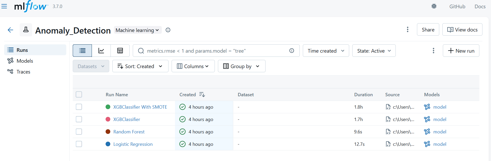
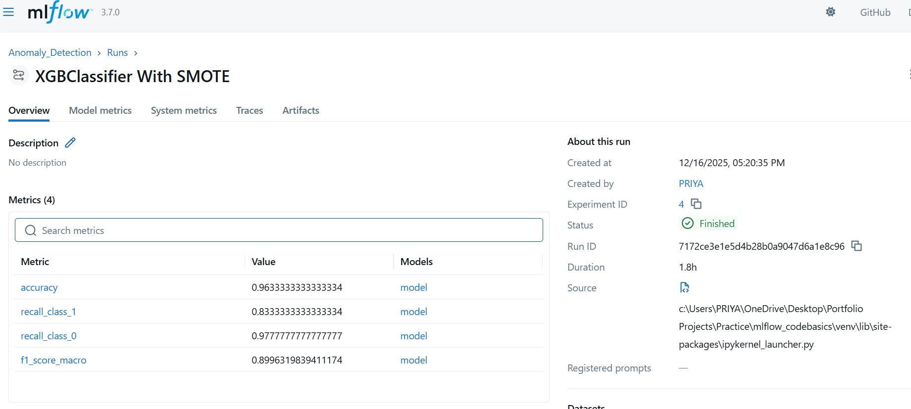
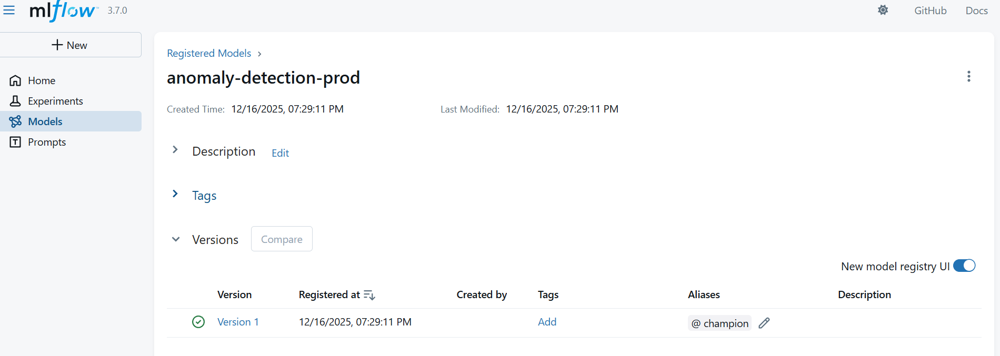

## MLOps with MLflow and DagsHub

An end-to-end demonstration of **experiment tracking**, **model versioning**, and **model lifecycle management** using **MLflow** with **DagsHub as a centralized tracking server**.

This project showcases how machine learning experiments can be tracked, compared, and promoted across stages using industry-standard MLOps tools.

---

### Project Highlights

- Multiple experiment runs with metric comparison
- Model logging and artifact management
- **MLflow Model Registry** with versioning
- MLflow Model Registry with model versioning
- Reproducible ML workflow
- Centralized MLflow tracking using **DagsHub** - https://dagshub.com/priya.vijayakumar1304/mlops-with-mlflow-and-dagshub.mlflow/

---

### Tech Stack

- **Python**
- **MLflow**
- **DagsHub**
- **Scikit-learn / XGBoost**
- **Jupyter Notebook**

---

### Project Structure

```text
.
├── mlflow_with_dagshub.ipynb          # MLflow tracking using DagsHub
├── tracking_multiple_experiment.ipynb # Multiple experiment runs
├── mlflow_model_registry.ipynb        # Model registry & stage transitions
├── requirements.txt
├── README.md
└── assets/                            # MLflow UI screenshots
```
### MLflow Experiment Tracking

This project logs:
- Model parameters
- Evaluation metrics (accuracy, recall, F1)
- Model artifacts
- Multiple experiment runs for comparison

Experiments are tracked centrally using DagsHub-hosted MLflow, enabling easy access without running MLflow locally.




### Run Details and Artifacts

Each run logs parameters, metrics, and model artifacts.



### Model Registry

Models are registered and versioned using the MLflow Model Registry.



### Workflow Overview

- Train models and log experiments
- Compare metrics across multiple runs
- Register best-performing model
- Promote model through lifecycle stages
- Track everything centrally via DagsHub

### How to Run Locally

```
git clone https://github.com/priya-vijayakumar1304/mlops-with-mlflow-and-dagshub.git
cd mlops-with-mlflow-and-dagshub
pip install -r requirements.txt
```
Run the notebooks in the following order:
1) **tracking_multiple_experiment.ipynb**
2) **mlflow_model_registry.ipynb**
3) **mlflow_with_dagshub.ipynb**

### Why This Project Matters

This project demonstrates practical MLOps skills beyond model training, including:
- Experiment reproducibility
- Centralized experiment tracking
- Model versioning and governance
- Model lifecycle management using MLflow
  
It reflects real-world workflows used by ML Engineers and MLOps teams.
